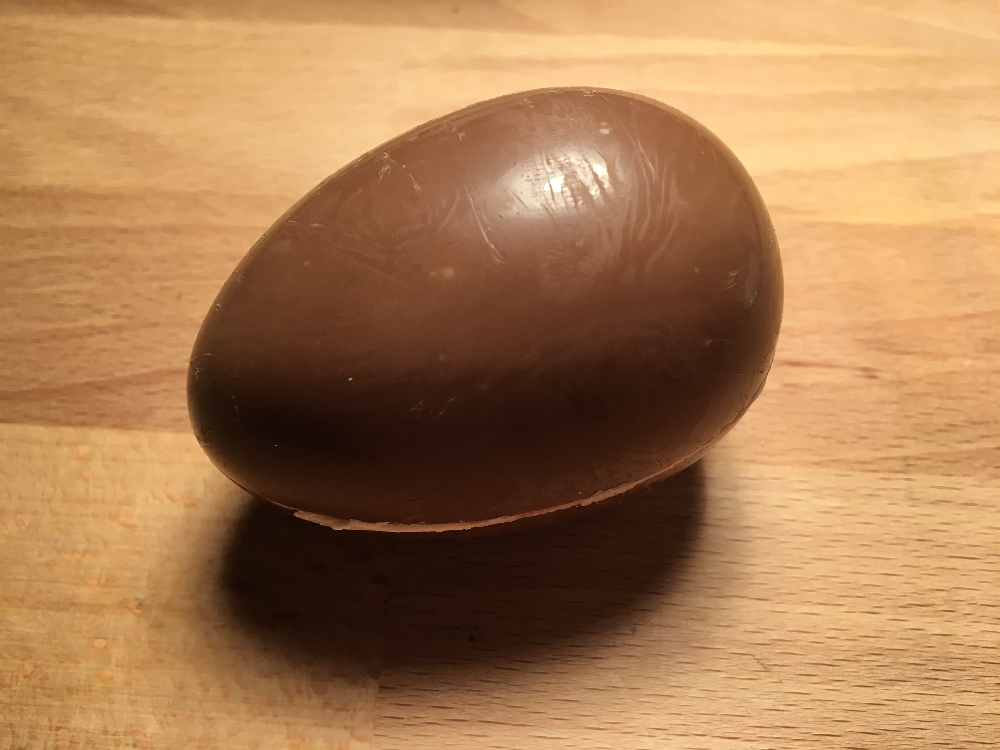
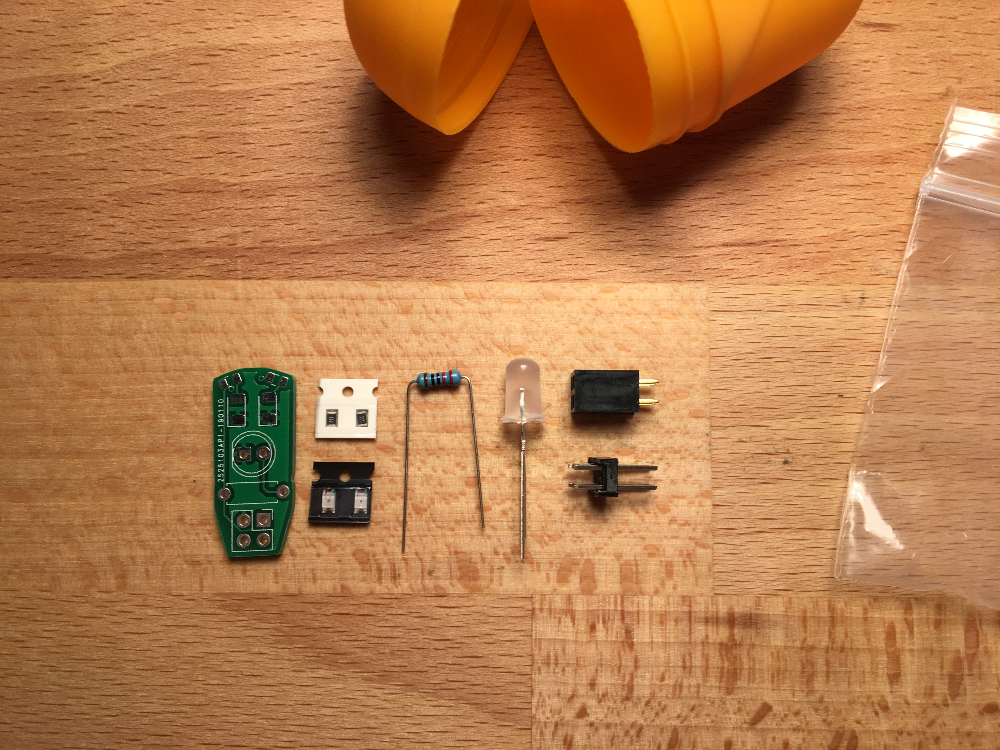
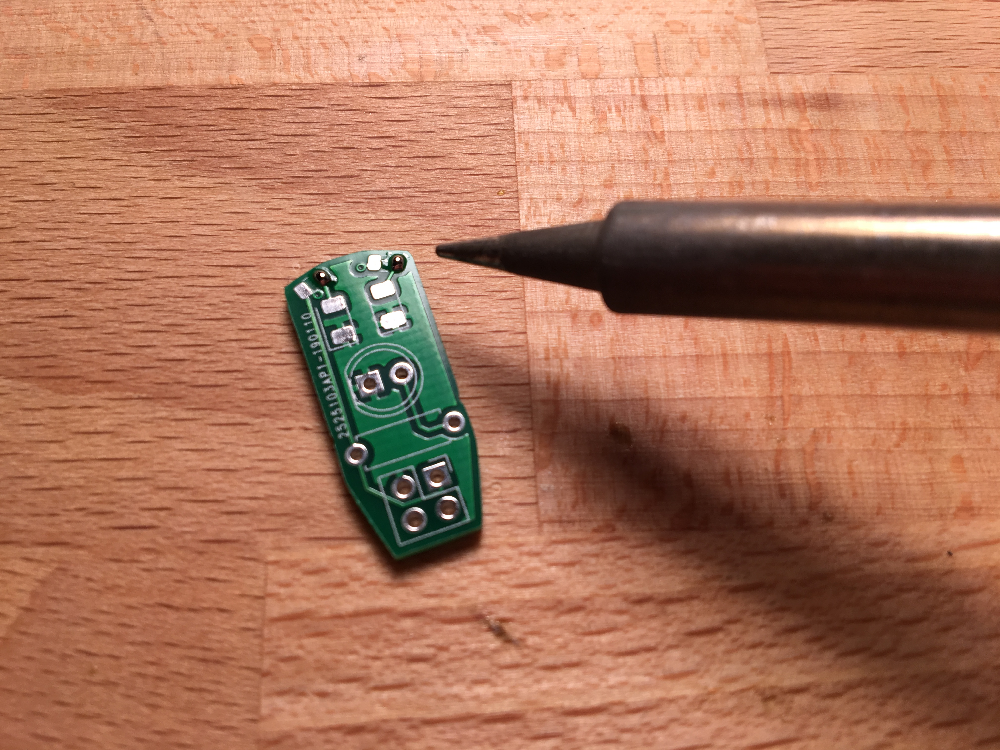
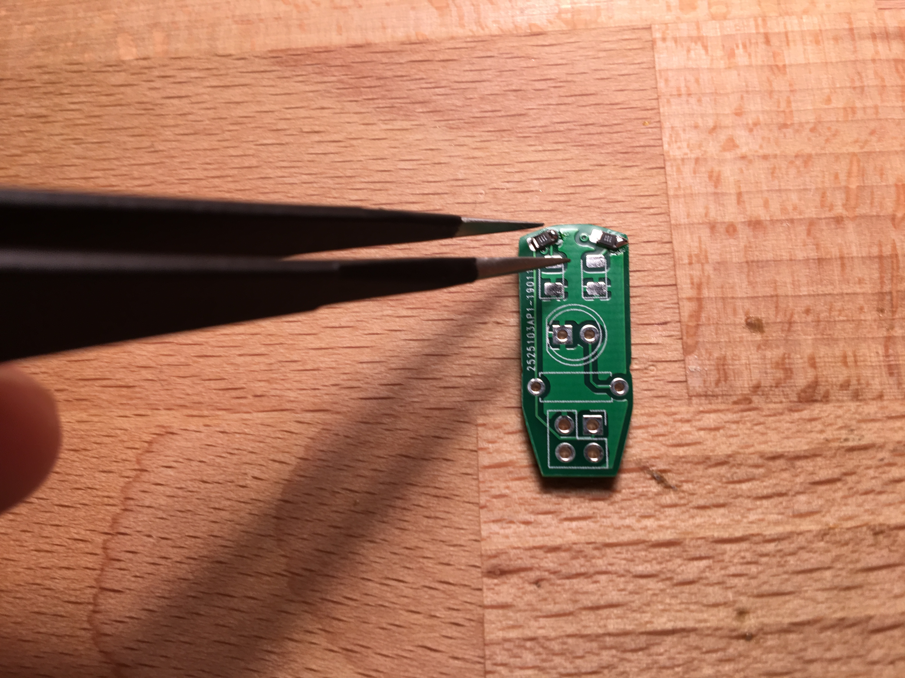
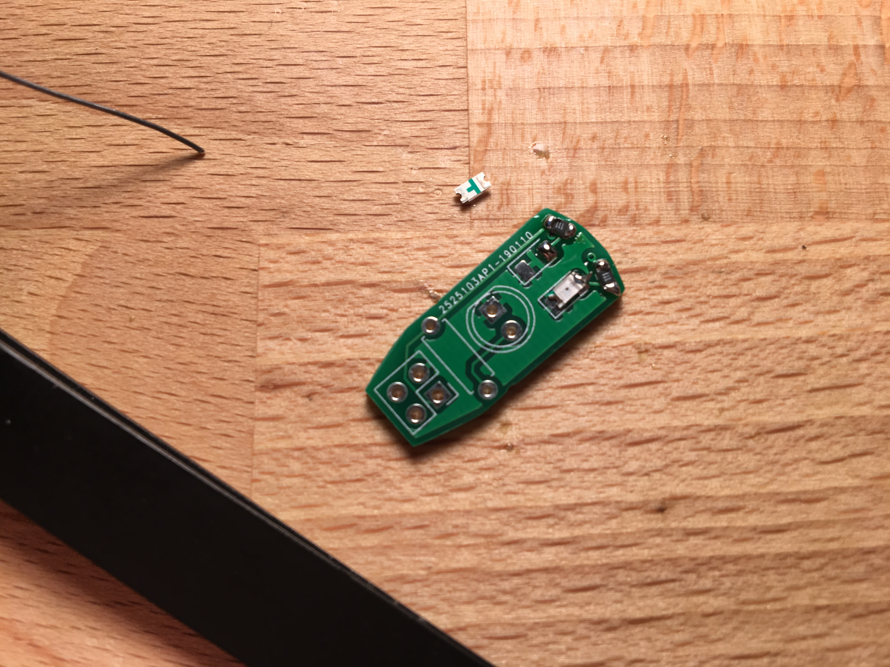
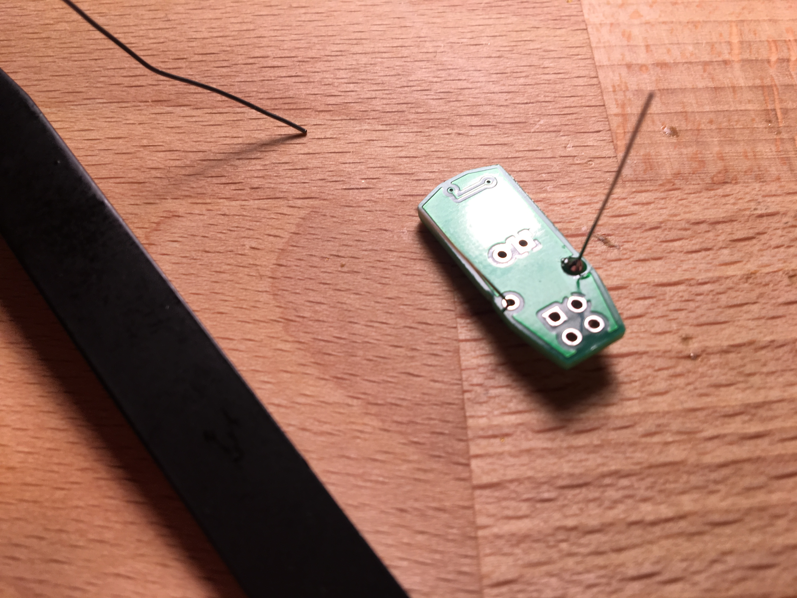
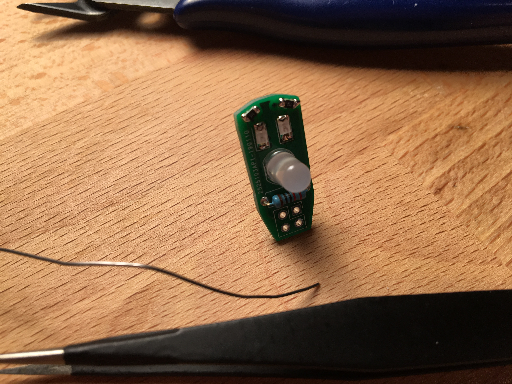
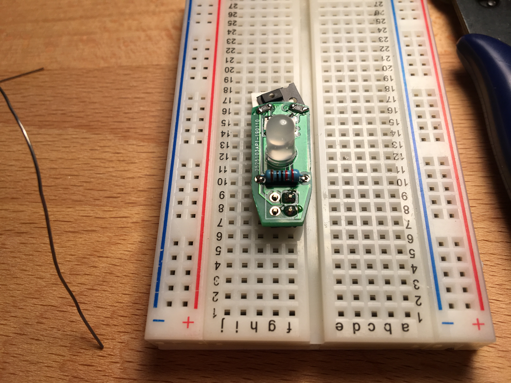
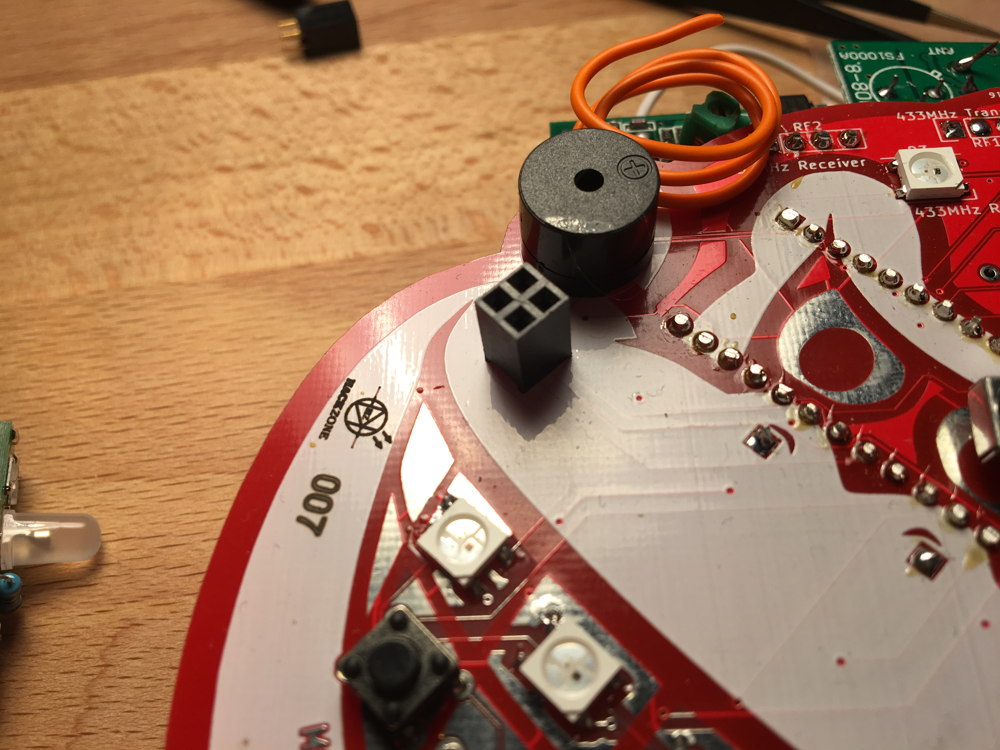
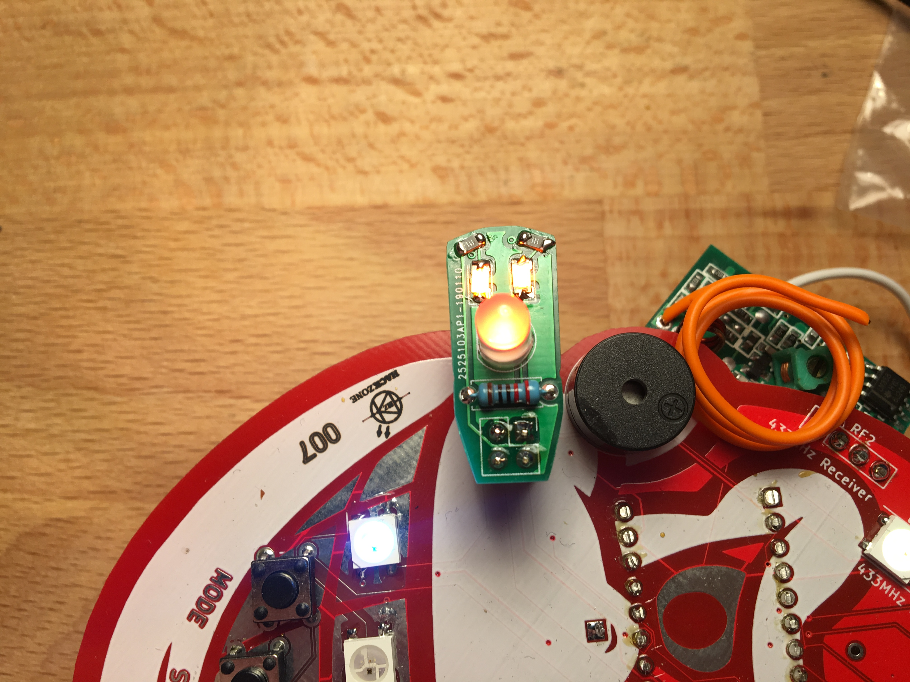

# Hacker Suprise Assembly Instructions

Congratulations, you have a Hacker Suprise. This document will guide you through the assembly of your suprise.

## Step 0:
EAT THE CHOCOLATE NOW, otherwise you have to wait until you have washed your hands. Soldering involves working with lead and that does not mix well with food.

## Step 1:
Check if you have all the required parts:
1. Pcb
2. SMD Resistors 2x (in white tape)
3. SMD LED (Colors can vary)
4. Through hole resistor
5. RGB flashing LED (shape can vary)
6. 2x2 female header
7. 2x2 male header

If you are missing parts, please tell the person you got the suprise from. Spare parts are available.

## Step 2
Apply tiny blobs of solder on the top pads of the board, on the side where you hold your soldering iron.

## Step 3
Using tweezers, solder one side of the SMD resistor (the black components in the paper tape). When they are fixed, solder the other side.

## Step 4
Apply the same method as step 2 to one side of the larger pads

## Step 5
The LEDs are directional. There is an arrow on the bottom and a green dot on the top of the component, this should point downward towards the white line under the pads. Solder one side and then the other.

## Step 6
Put the through hole resistor in the board and solder it.

## Step 7
Put the LED in the board (pay attention to the footprint on the board and the straight edge on the LED) and solder it.

## Step 8
Solder the male headers to the rear of the board. This will be easier if you insert the headers in a breadboard. Solder one pad, make sure the board is level and then solder the other pads.

## Step 9
Solder the female headers to your badge, such that you can insert your addon to the front.

## Step 10
Insert the addon with the board pointing to the top of the badge.

